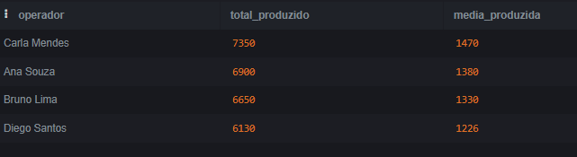
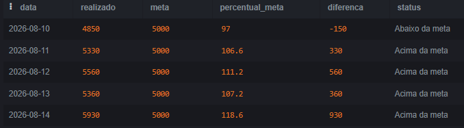
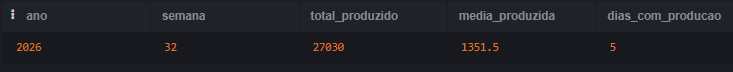

#  Análise Operacional com SQL

##  Sobre o projeto

Projeto desenvolvido para analisar dados fictícios de uma operação utilizando **SQL e SQLite**.

O objetivo é transformar dados brutos de produção em indicadores que permitam acompanhar produtividade, cumprimento de metas e desempenho operacional.

Este projeto foi desenvolvido para fins de **estudo e portfólio**, simulando situações comuns em análises de dados operacionais.

##  Objetivos

- Analisar a produção diária
- Comparar produção realizada x meta
- Identificar o desempenho por operador
- Criar um ranking de produtividade
- Avaliar o desempenho operacional
- Identificar dias abaixo e acima da meta
- Consolidar indicadores para apoiar análises de desempenho

## 🛠️ Tecnologias utilizadas

- SQL
- SQLite
- SQLite Online

##  Conceitos SQL aplicados

Durante o projeto foram utilizados conceitos como:

- `SELECT`
- `JOIN`
- `GROUP BY`
- `ORDER BY`
- `SUM()`
- `AVG()`
- `COUNT()`
- `ROUND()`
- `CASE WHEN`
- Funções de data com `strftime()`

##  Principais análises

### 1. Produção diária

Consolidação da quantidade produzida em cada dia da operação.

### 2. Produtividade por operador

Comparação do volume produzido pelos operadores, permitindo identificar diferenças de produtividade.

### 3. Meta x realizado

Comparação entre a produção realizada e a meta diária, incluindo:

- Percentual de atingimento
- Diferença para a meta
- Classificação do resultado

### 4. Ranking de operadores

Ordenação dos operadores de acordo com o volume total produzido.

### 5. Análise semanal

Agrupamento dos dados por semana para acompanhar a evolução da produção ao longo do tempo.

##  Exemplos de resultados

### Produção por operador



### Meta x realizado



### Produção semanal



##  Insights obtidos

A análise permite identificar:

- Operadores com maior volume de produção
- Dias em que a meta operacional não foi atingida
- Percentual diário de atingimento da meta
- Diferença entre produção planejada e realizada
- Evolução da produção ao longo do período

Esses indicadores podem auxiliar no acompanhamento de produtividade e na identificação de desvios operacionais.

##  Estrutura do projeto

```text
analise-operacional-sql/
│
├── README.md
│
├── database/
│   ├── schema.sql
│   └── dados.sql
│
├── queries/
│   ├── 01_producao_diaria.sql
│   ├── 02_producao_operador.sql
│   ├── 03_meta_realizado.sql
│   ├── 04_ranking_operadores.sql
│   └── 05_analise_final.sql
│
└── images/
    ├── producao_operador.png
    ├── meta_realizado.png
    └── producao_semanal.png
```

##  Como executar

1. Execute o arquivo `database/schema.sql` para criar as tabelas.
2. Execute `database/dados.sql` para inserir os dados fictícios.
3. Execute os arquivos da pasta `queries/` para realizar as análises.

## ⚠️ Observação

Todos os dados utilizados neste projeto são **fictícios** e foram criados exclusivamente para fins de estudo e demonstração de conhecimentos em SQL.
